<h1 align="center"> 🎓 University Management System API</h1>


This is a Flask-based REST API project for accessing university departments, students, and courses data from a PostgreSQL database.  
It provides easy-to-use endpoints, Swagger API documentation, and a modern web interface for testing.

---

## 🚀 Features

- RESTful API GET endpoints for:
  - **Departments** with instructor details
  - **Students** with course enrollment details
  - **Courses** with instructor teaching details
- **Swagger API Documentation** (`Flasgger` powered)
- **PostgreSQL database** integration
- **Responsive Web Interface** (HTML/CSS)
- Modular code structure using Flask **Blueprints**
- Pagination support for all APIs
- **CORS** support enabled for cross-origin access

---

## 📦 Prerequisites

- Python 3.x
- PostgreSQL database (with university data loaded)
- `pip` package manager

---

## 🛠 Installation

1. **Clone the repository:**
   ```bash
   git clone <repository-url>
   cd <project-directory>
   ```

2. **Create and activate a virtual environment:**
   ```bash
   python -m venv venv
   source venv/bin/activate  # On Windows: venv\Scripts\activate
   ```

3. **Install dependencies:**
   ```bash
   pip install -r requirements.txt
   ```

4. **Configure the database connection:**
   - Update your **`db.py`** file with correct PostgreSQL credentials (host, port, username, password, database name).

---

## 🗂 Project Structure

```plaintext
.
├── app.py               # Main Flask app
├── db.py                # PostgreSQL connection setup
├── requirements.txt     # Python dependencies
├── routes/              # API route handlers
│   ├── departments.py
│   ├── students.py
│   └── courses.py
└── webpage/             # Static web portal
    └── index.html
```

---

## ▶️ Running the Application

1. **Start the Flask server:**
   ```bash
   python app.py
   ```

2. **Access the endpoints:**
   - Web Portal: [http://127.0.0.1:5000](http://127.0.0.1:5000)
   - Swagger API Documentation: [http://127.0.0.1:5000/apidocs/](http://127.0.0.1:5000/apidocs/)

---

## 🔥 Web Interface

The web interface provides:

- **University Portal Theme** 🎓
- Quick links to:
  - Departments API
  - Students API
  - Courses API
- Embedded Swagger API documentation

---

## 🖼 Screenshots

### 1. Main University Portal
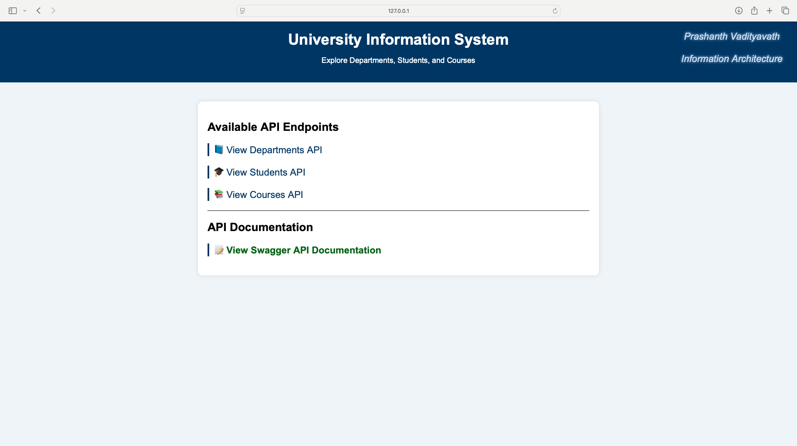

---

### 2. Departments API Response
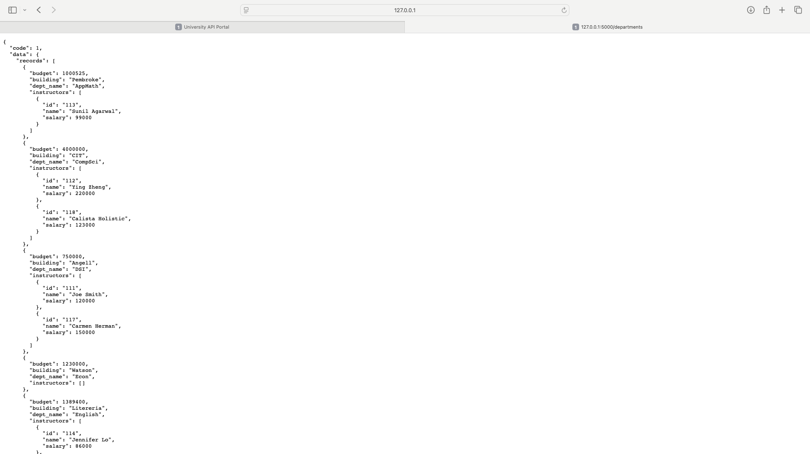

---

### 3. Students API Response
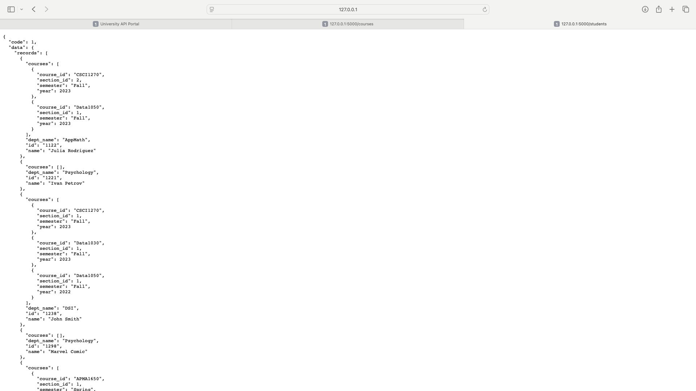

---

### 4. Courses API Response
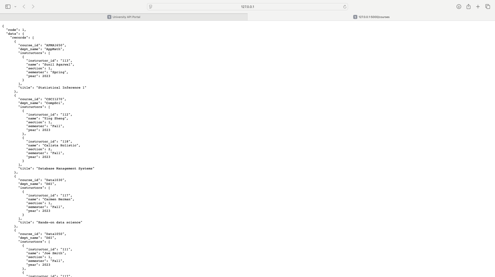

---

### 5. Swagger API Documentation Interface
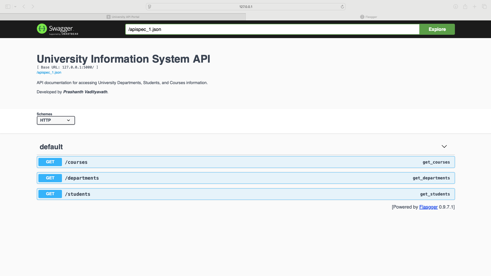

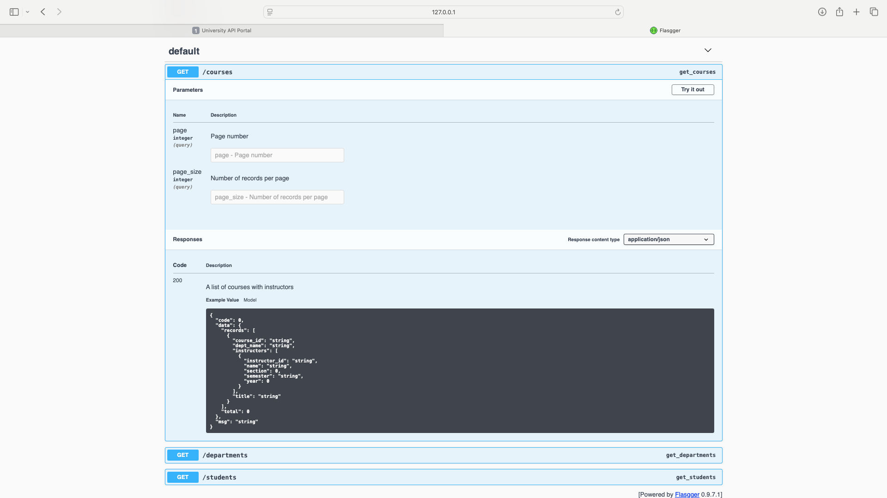

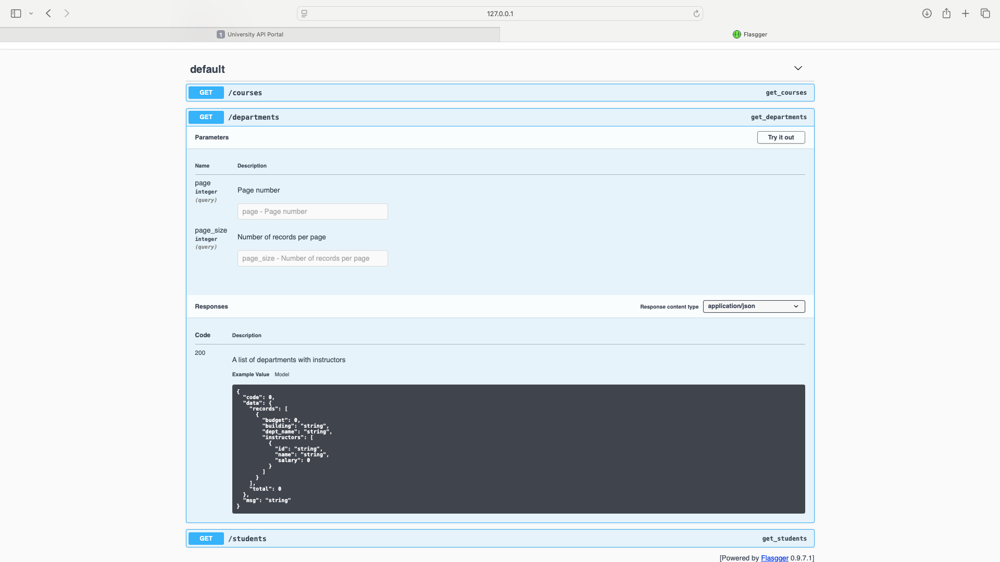

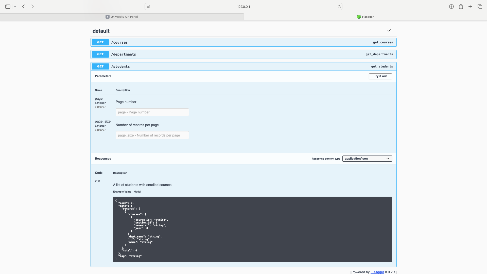

## 📚 API Endpoints

All APIs support **pagination** via:

- `page` (default = 1)
- `page_size` (default = 10)

Common JSON response structure:

```json
{
  "code": 1,
  "msg": "Success",
  "data": {
    "records": [],
    "total": 0
  }
}
```

---

### 🧬 Departments

- **Endpoint:** `/departments`
- **Returns:** List of departments and associated instructors.

---

### 🧑‍🏫 Students

- **Endpoint:** `/students`
- **Returns:** List of students and enrolled courses.

---

### 📚 Courses

- **Endpoint:** `/courses`
- **Returns:** List of courses and teaching instructors.

---

## ⚙️ Dependencies

- **Flask** - Web framework
- **Flasgger** - Swagger API Documentation
- **Flask-RESTX** - API abstraction layer (optional)
- **Flask-CORS** - Cross-Origin Resource Sharing
- **psycopg2** - PostgreSQL Adapter for Python

---

## 🧪 API Testing Scenarios (Swagger Testing)

| Test No. | Input (Page, Page Size)            | Expected Behavior                                   | Status     |
|----------|------------------------------------|----------------------------------------------------|------------|
| 1        | Page = 1, Page Size = 1             | Successfully fetch 1 record                         | ✅ Passed  |

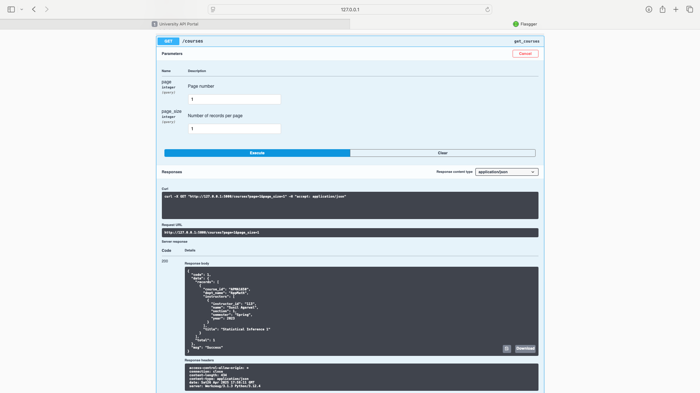

| Test No. | Input (Page, Page Size)            | Expected Behavior                                   | Status     |
|----------|------------------------------------|----------------------------------------------------|------------|
| 2        | Page = 1, Page Size = 0             | Error: "Enter a valid page size greater than 0"     | ✅ Passed  |

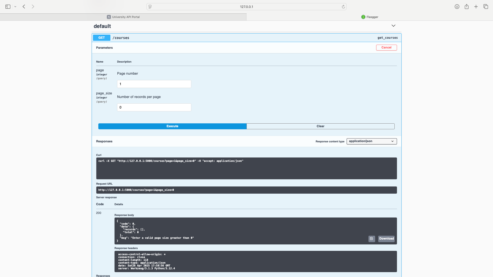

| Test No. | Input (Page, Page Size)            | Expected Behavior                                   | Status     |
|----------|------------------------------------|----------------------------------------------------|------------|
| 3        | Page = 1, Page Size = (empty)       | Defaults to page_size = 10                          | ✅ Passed  |


| Test No. | Input (Page, Page Size)            | Expected Behavior                                   | Status     |
|----------|------------------------------------|----------------------------------------------------|------------|
| 4        | Page = (empty), Page Size = (empty) | Defaults to page = 1, page_size = 10                | ✅ Passed  |

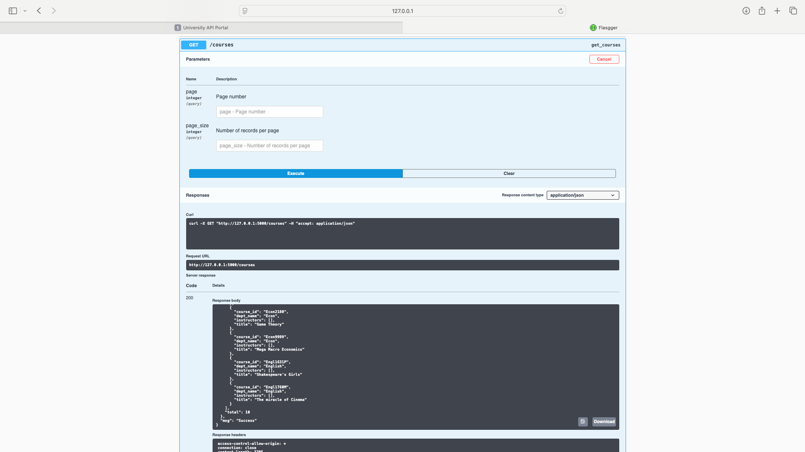

| Test No. | Input (Page, Page Size)            | Expected Behavior                                   | Status     |
|----------|------------------------------------|----------------------------------------------------|------------|
| 5        | Page = 0, Page Size = (empty)       | Error: "Enter a valid page number greater than 0"   | ✅ Passed  |

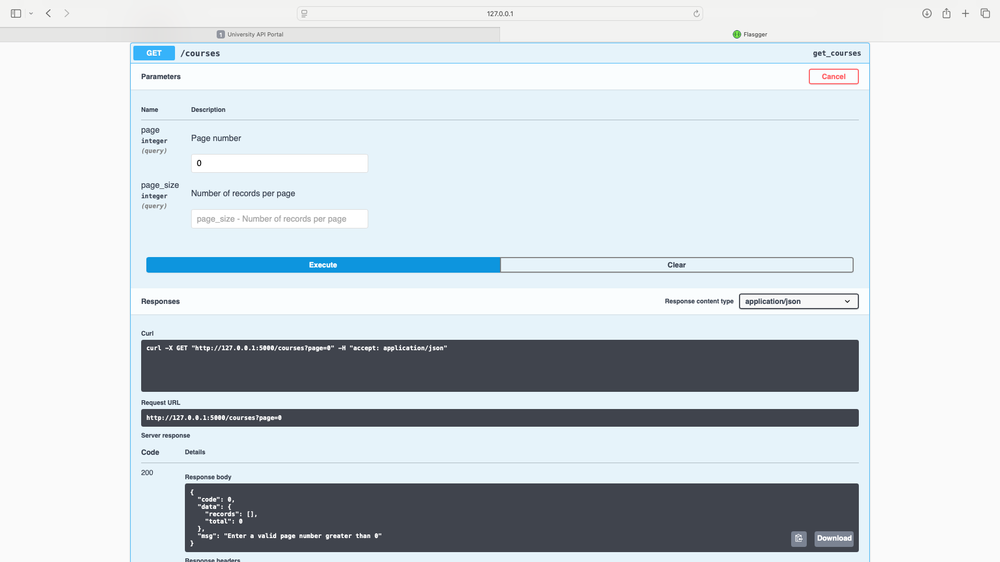


## 👨‍💻 Developed by

<p align="center"><b><span style="font-size:2em;">Prashanth Vadityavath</span></b></p>

---


